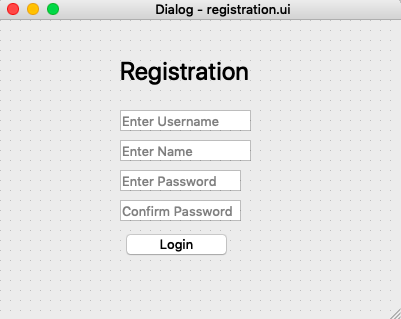

# Design

I wanted to make this app as simple as possible for my client, so most functions were straightforward and there was nothing too crazy.

Unfortunately, I currently do not have the sketches of what I initially wanted the application to look like so here are glimps from what i designed in QT designer.

Above is the system diagram which shows the input (Mouse and Keyboard), the pages used in the application and how they are connected, and the output (Screen Monitor)
