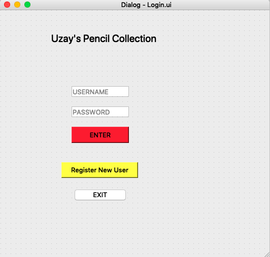
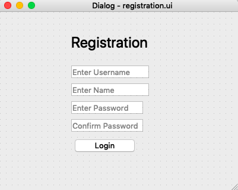

# Development

Sketches of the app were made in QT Designer, which includes the tables and buttons. In order to be able to code for the pages and make functions out of the features it must be run under the code below.

```
pyuic5 registration.ui -o registration.py
```

Using an example of the registration page, the code above will convert the UI file into a python file allowing me to start coding.

```.py
class mainWindowApp(QMainWindow, mainW):
    def __init__(self, parent=None):
        super(mainWindowApp, self).__init__(parent)
        self.setupUi(self)  # build the UI
        self.data = self.load_data()
        self.tableWidget.cellChanged.connect(self.changeDB)
        loginVar = LoginApp(self)
        loginVar.show()
        self.yes_btn.clicked.connect(self.save)
        self.No_btn.clicked.connect(self.cancel)
        self.logout_btn.clicked.connect(self.logout)     
```
This code is created to initialise and startup the mainwindow. Which come form the mainW UI file. When the app is run, the Login window is shown first for security.

```.py
class LoginApp(loginD, QMainWindow):
    def __init__(self, parent=None):
        super(LoginApp, self).__init__(parent)
        self.setupUi(self)  # build the UI


        # this is a behavior for the exit button
        self.exit_btn.clicked.connect(self.exitApp)
        self.register_btn.clicked.connect(self.regApp)
        self.enter_btn.clicked.connect(self.try_login)
```
The code above shows how the login window is initialised and set up, as you can see there are behaviors created for the buttons when pressed. They will be explained below.




As shown in the image above there three buttons on the login window. Login, Register and Exit.

```.py
    def exitApp(self):
        sys.exit(0)  # 0 means exit without error


    # this opens the registration form
    def regApp(self):
        regVar = registerApp(self)
        regVar.show()
```
These are two order of operations defined for when the button exit is pressed and and the button register is pressed. When exit is pressed it closes the program and when register is pressed it shows the register window, we will look into the login in button in a bit.



In the image above, there are four boxes for the user to input information and a login button

```.py
self.pushButton.clicked.connect(self.try_register)
```
Once the inputs are all filled out and the button is pressed, the system will run operations defined as try register.
```.py
def try_register(self):
        # validation
        if self.validate_registration():
            self.store()

    def validate_username(self):
        username = self.username_ln.text()
        if '@' not in username:
            self.username_ln.setStyleSheet("border: 2px solid red")
            return False
        else:
            self.username_ln.setStyleSheet("border: 2px solid green")
            return True

    def validate_name(self):
        name = self.name_ln.text()
        if name.isalpha() and len(name) > 5:
            self.name_ln.setStyleSheet("border: 2px solid red")
            return True
        else:
            self.name_ln.setStyleSheet("border: 2px solid green")
            return False

    def validate_password(self):
        password = self.password_ln.text()
        if len(password) < 8:
            self.password_ln.setStyleSheet("border: 2px solid red")
            return False
        else:
            self.password_ln.setStyleSheet("border: 2px solid green")
            return True

    def validate_cpassword(self):
        password = self.password_ln.text()
        confirmpass = self.confirmpass_ln.text()
        if confirmpass == password:
            self.confirmpass_ln.setStyleSheet("border: 2px solid green")
            return True
        else:
            self.confirmpass_ln.setStyleSheet("border: 2px solid red")
            return False

    def validate_registration(self):
        username = self.validate_username()
        name = self.validate_name()
        password = self.validate_password()
        cpassword = self.validate_cpassword()
        return username and name and password and cpassword

    def store(self):
        username = self.username_ln.text()
        password = self.password_ln.text()
        print("Hashing", username + password)
        msg = hash_password(username + password)
        with open('Output.txt', "a") as output_file:
            output_file.write('{}\n'.format(msg))
        self.close()
```
Try register is defined above, it runs validate_registration which checks if each individual boxes of input match the requirements and once it does it runs the operation of store. The store program takes the username and password inputted, combines it and hashes it to make it more secure. 

```. py
def hash_password(password):
    salt = hashlib.sha256(os.urandom(60)).hexdigest().encode('ascii')
    pwdhash = hashlib.pbkdf2_hmac('sha512', password.encode('utf-8'),
                                          salt, 100000)
    pwdhash = binascii.hexlify(pwdhash)
    return (salt + pwdhash).decode('ascii')
```
This is code defines the hashing method, first it Converts the 64 bytes into 64 ascii text characters (salt) and then it converts the text and symbols using UTF-8 standard and hashes the encoded password using the 64 bytes long salt to a default of 64 bytes. The process is then repeated 100000 times to increase randomness (pwdhash). Afterwards it converts each of the 64 bytes of the hash into a two-bytes Hexadecimal string (pwdhash) and finally gives us back a string where the salt is first followed by the hashed password. 

After this process is done the string is then stored in 'output.txt' and the window closes.

Now we can come back into the Login Page.

Once my client has registered and has inputted the correct log in information. They press the button enter. Which runs more operations.

```.py
 self.enter_btn.clicked.connect(self.try_login)


    def try_login(self):
        username = self.Username.text()
        password = self.lineEdit_2.text()

        userpass = username + password
        with open("Output.txt", "r") as paswrd:
            for stored_password in paswrd:
                if mylib.verify_password(stored_password, userpass):
                    self.close()
```
The operation is defined as Try_login, the program takes the username and input password, combines it and goes output.txt and runs a program which is defined in mylib.

```.py
def verify_password(stored_password, provided_password):
    salt = stored_password[:64]
    stored_password = stored_password[64:-1]
    pwdhash = hashlib.pbkdf2_hmac('sha512',
                                          provided_password.encode('utf-8'),
                                          salt.encode('ascii'),
                                          100000)
    pwdhash = binascii.hexlify(pwdhash).decode('ascii')
    return pwdhash == stored_password
```
The program recovers the salt as the first 64 characters of the hash (salt) and then recovers the password as the characters of the hash from position 64 to the end (stored_password). Afterwards a hash is created with the recovered salt for the password provided (pwdhash). The hashes should be the same, and if that is true, the login window then closes, Allowing the client to see the mainwindow.

The mainwindow consists of The database table of pencils, A yes button, no Button and a logout. The database is first entered through a csv file which has been connected to the code.
```.py    
    load_data(self):
        # here we read the csv files
        data = []
        with open('db.csv') as mydatabase:
            file = csv.reader(mydatabase, delimiter=",")
            for i, row in enumerate(file):
                for j, col in enumerate(row):
                    data.append((i, j, col))
                    self.tableWidget.setItem(i, j, QTableWidgetItem(col))

        return data
```
A comma separated file consists of information obviously separated by commas. The information is then displayed onto the table. If the user wishes to edit the table he can simply directly clicked on where he wishes to change the table and edit directly. This is shown below

```.py
 self.tableWidget.cellChanged.connect(self.changeDB)
    def changeDB(self):
        item = self.tableWidget.currentItem()
        row = self.tableWidget.currentRow()
        col = self.tableWidget.currentColumn()
        self.tableWidget.item(row, col).setBackground(QtGui.QColor(100, 100, 150))
        print(item.text())
        self.yes_btn.setDisabled(False)
        self.No_btn.setDisabled(False)
```
The code above allows the client to change the information and when it is changed, the cell wherein the information was changed will change colour. Allowing the client to see what changes were made.

The user then has 2 options, two save using the yes button or to cancel changes made using the no button.

```.py
self.yes_btn.clicked.connect(self.save)
  def save(self):
        with open("db.csv", "w", newline="") as mydatabase:
            writer = csv.writer(mydatabase)
            maxrow = self.tableWidget.rowCount()
            maxcolumn = self.tableWidget.columnCount()

            for row in range(maxrow): # goes through each row
                line = []
                for col in range(maxcolumn): # goes over each column, looks at one item at a time
                    data = self.tableWidget.item(row, col)
                    if data is not None:
                        line.append(data.text()) # add into empty list of "line
                writer.writerow(line) # overwrite what was inside in the csv file
```
I'd like to thank Chinomnso, he helped me in this part of the code. This is the program when the yes button is pressed, what it basically does is go through everything in the table and overwrites it in the csv file.

```.py
    def cancel(self):
        self.load_data()
```
This is the program defined for the button no. It doesn't save the data and just reloads the table.

If the logout button is pressed:
```.py
    def logout(self):
        var = LoginApp(self)
        var.show()
```
It just opens back the log in window wherein the client can now exit.
      
