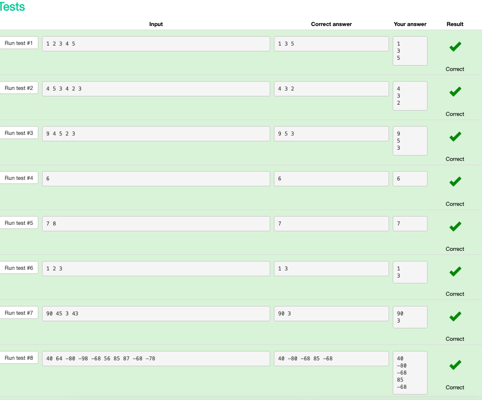
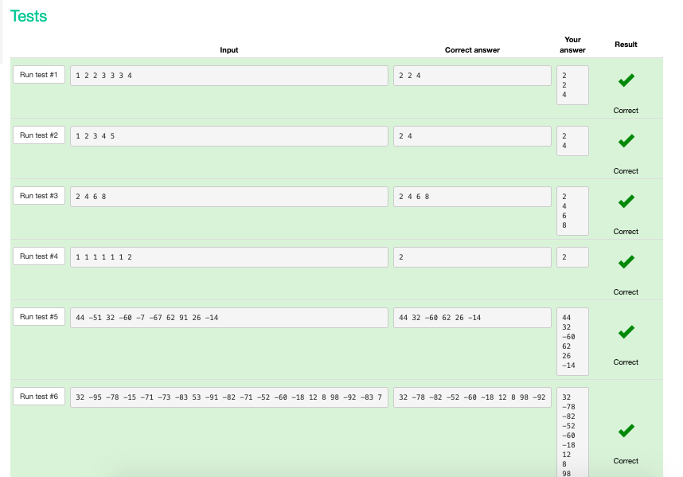
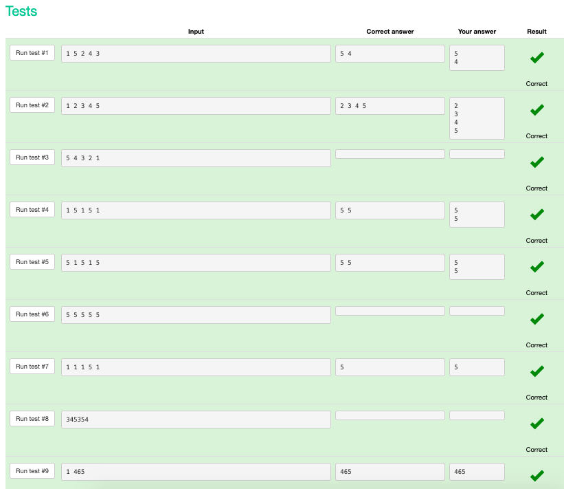
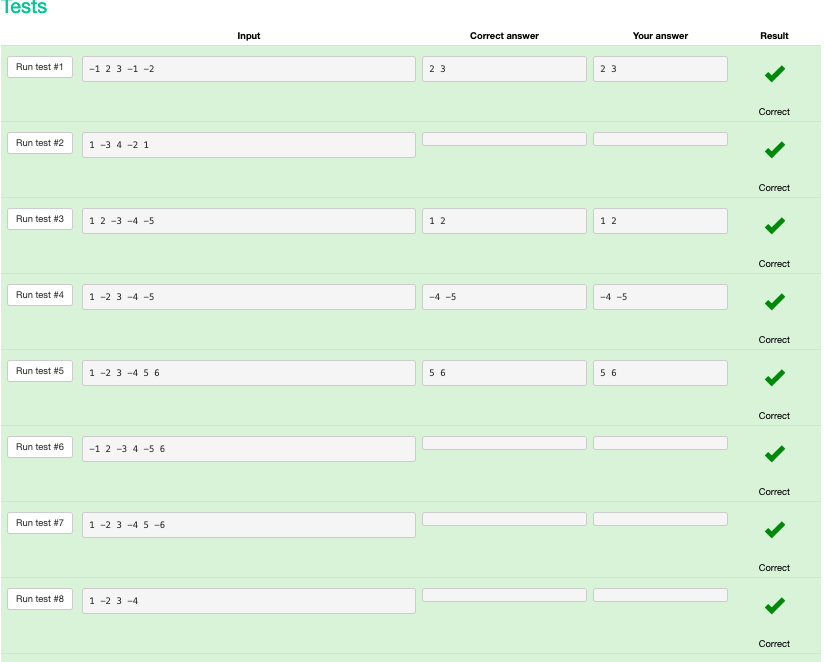
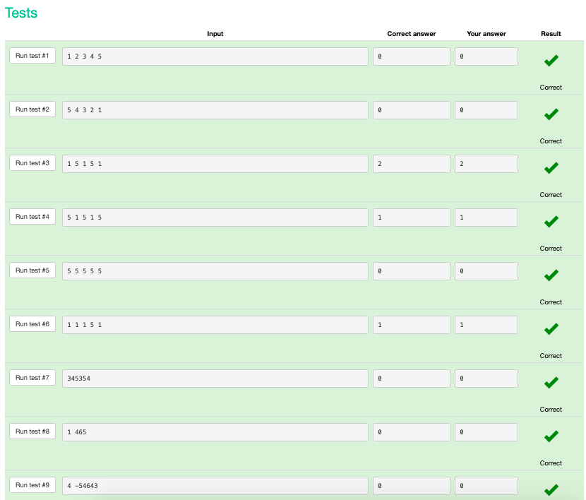

```.py
x = input().split() #puts inputs into list of strings
for i in range(0, len(x), 2): #gets even numbers
    print(x[i])
``` 


```.py
# a = int(input())
# Read a float:
# b = float(input())
# Print a value:
# print(a, b)
# Given a list of numbers, find and print all elements that are an even number. In this case use a for-loop that iterates over the list, and not over its indices! That is, don't use range()
x = [int(i) for i in input().split()]
for element in x:
    if element % 2 == 0:
        print(element)
``` 


```.py
# Read an integer:
# a = int(input())
# Read a float:
# b = float(input())
# Print a value:
# print(a, b)
x = [int(i) for i in input().split()]
for i in range(1, len(x)):
    if x[i - 1] * x[i] > 0:
        print(x[i - 1], x[i])
        break
``` 


```.py
# Read an integer:
# a = int(input())
# Read a float:
# b = float(input())
# Print a value:
# print(a, b)
x = [int(i) for i in input().split()]
for i in range(1, len(x)):
    if x[i - 1] * x[i] > 0:
        print(x[i - 1], x[i])
        break
```        


```.py
# Read an integer:
# a = int(input())
# Read a float:
# b = float(input())
# Print a value:
# print(a, b)
x = [int(i) for i in input().split()]
total = 0
for i in range(1, len(x) - 1):
    if x[i - 1] < x[i] > x[i + 1]:
        total += 1
print(total)
```

