```.py
# This program reads two numbers and prints their sum:
a = int(input())
b = int(input())
c = int(input())
print(a + b + c)
```
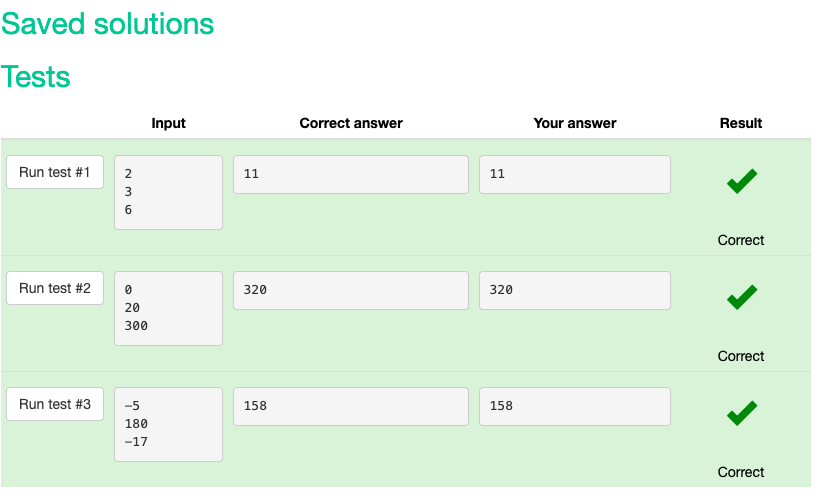

```.py
# Read an integer:
a = int(input())
# Read a float:
b = int(a ** 2)
# Print a value squared:
print(b)
```
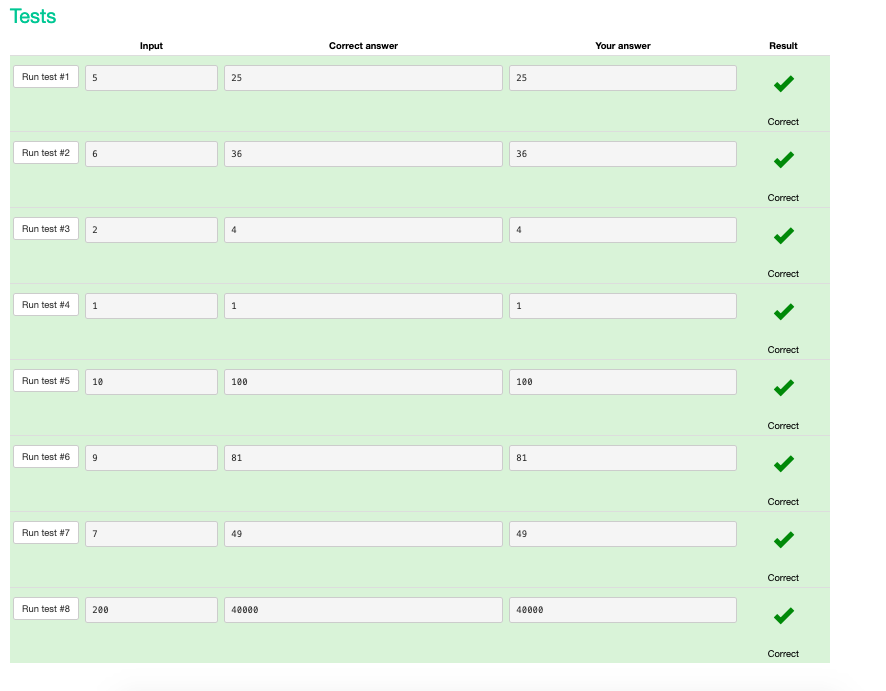

```.py
# Read the numbers like this:
n = int(input())
k = int(input())
# Print the result with print()
print(k // n)
print(k % n)
```
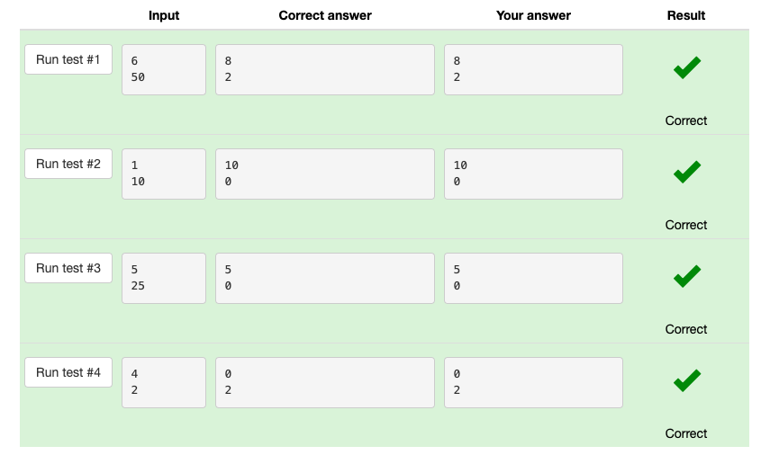

```.py
# Read an integer:
a = int(input())
# Read a float:
b = int(a - 1)
c = int(a + 1)
# Print a value:
print("The next number for the number {} is {}".format(a, c))
print("The previous number for the number {} is {}".format(a, b))
```
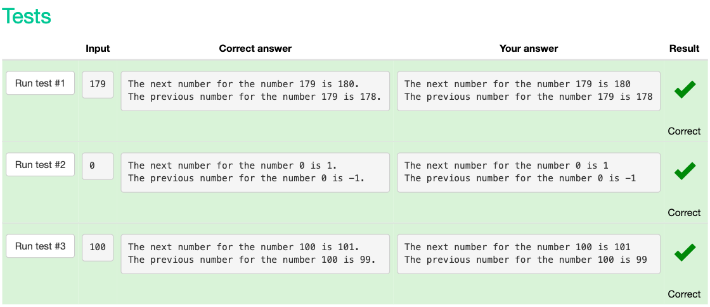

```.py
# Read an integer:
# a = int(input())
# Read a float:
# b = float(input())
# Print a value:
# print(a, b)
hour1 = int(input())
minute1 = int(input())
second1 = int(input())
timestamp1 = int((hour1 * 3600) + (minute1 * 60) + second1)
hour2 = int(input())
minute2 = int(input())
second2 = int(input())
timestamp2 = int((hour2 * 3600) + (minute2 * 60) + second2)
moment = int(timestamp2 - timestamp1)
print(moment)
```
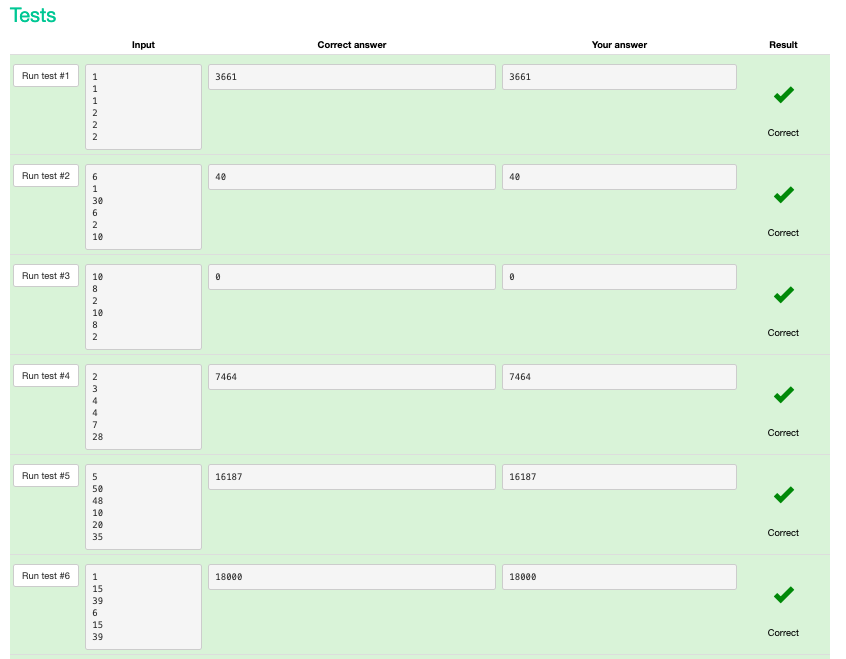

```.py
# Read an integer:
# a = int(input())
# Read a float:
# b = float(input())
# Print a value:
# print(a, b)
a = int(input())
digit = int(a % 10)
print(digit)
```
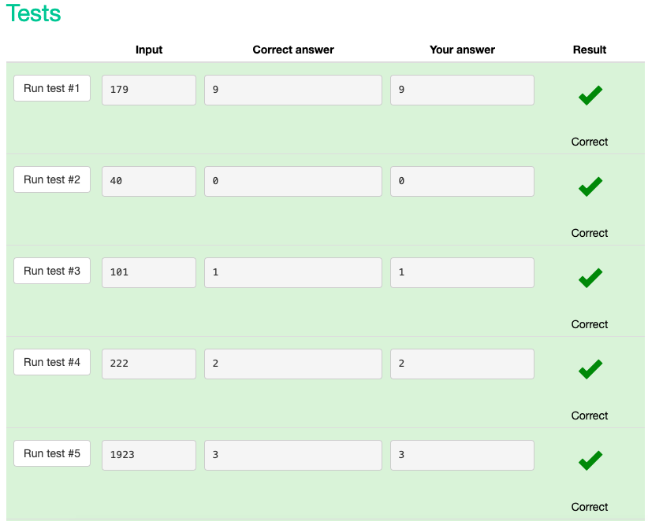

```.py
# Read an integer:
# a = int(input())
# Read a float:
# b = float(input())
# Print a value:
# print(a, b)
a = int(input())
b = int(a // 10)
tens = int(b % 10)
print(tens)
```
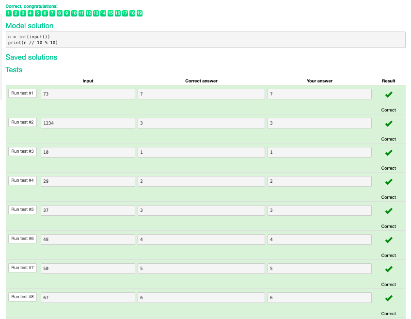

```.py
# Read an integer:
# a = int(input())
# Read a float:
# b = float(input())
# Print a value:
# print(a, b)
n = int(input())
m = int(input())
days = (m // n)
if ((m % n) == 0):
    print(round(days))
else:
    print(round(days + 1))
``` 
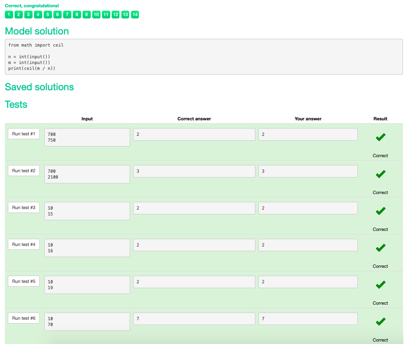

```.py
n = int(input())
hours = n // 60
minutes = n % 60
print(hours, minutes)
```
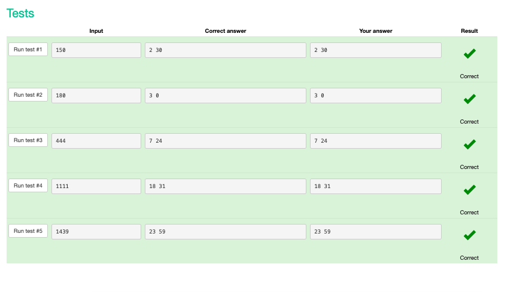

```.py
# Read an integer:
# a = int(input())
# Read a float:
# b = float(input())
# Print a value:
# print(a, b)
num1 = int(input())
num2 = int(input())
if (num1 > num2):
    print(num2)
else:
    print(num1)
```
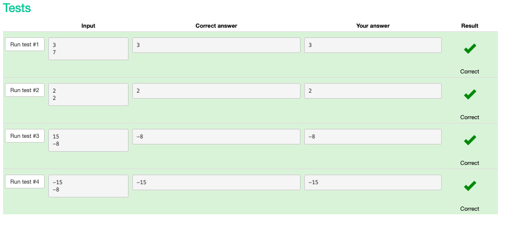

```.py
# Read an integer:
# a = int(input())
# Read a float:
# b = float(input())
# Print a value:
# print(a, b)
num = int(input())
if num > 0:
    print("1")
elif num < 0:
    print("-1")
else:
    print("0")
```
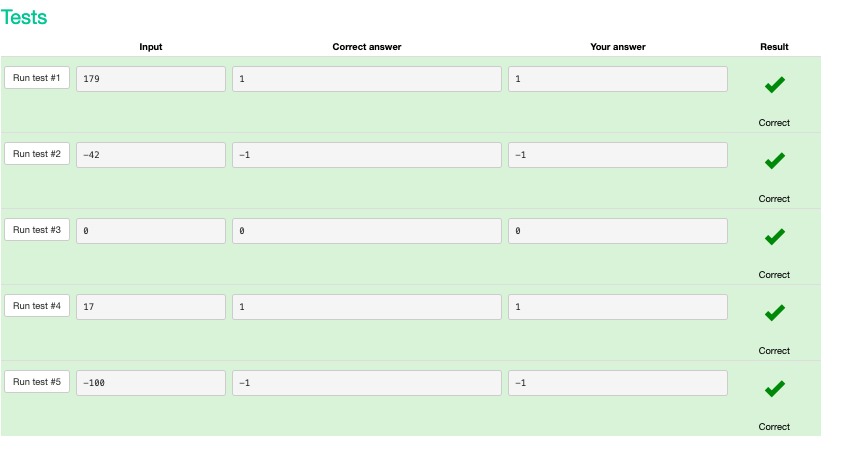

```.py
# Read an integer:
# a = int(input())
# Read a float:
# b = float(input())
# Print a value:
# print(a, b)
num1 = int(input())
n1 = int(input())
num2 = int(input())
n2 = int(input())
if num1 == num2 or n1 == n2:
    print('YES')
else:
    print('NO')
```
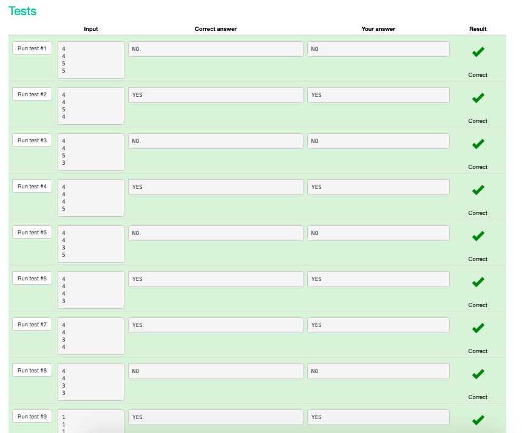

```.py
# Read an integer:
# a = int(input())
# Read a float:
# b = float(input())
# Print a value:
# print(a, b)
n = int(input())
m = int(input())
k = int(input())
if k < n * m and ((k % n == 0) or (k % m == 0)):
    print('YES')
else:
    print('NO')
```

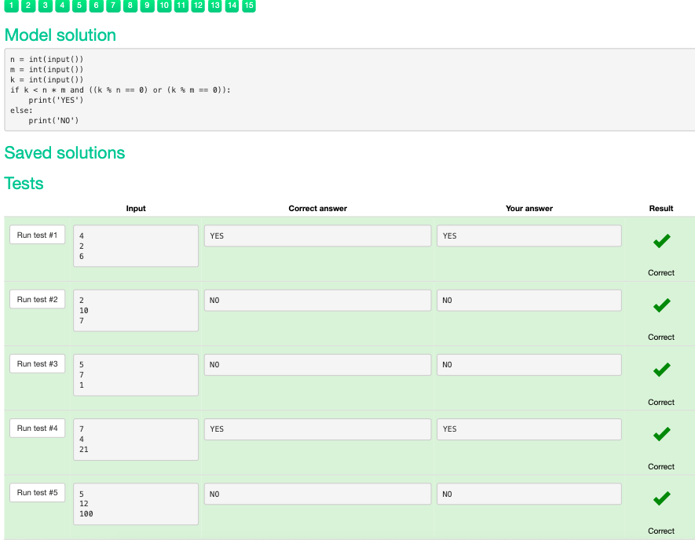

```.py
# Read an integer:
# a = int(input())
# Read a float:
# b = float(input())
# Print a value:
# print(a, b)
n = int(input())
sum = 0
for i in range(n):
    sum += int(input())
print(sum)
```
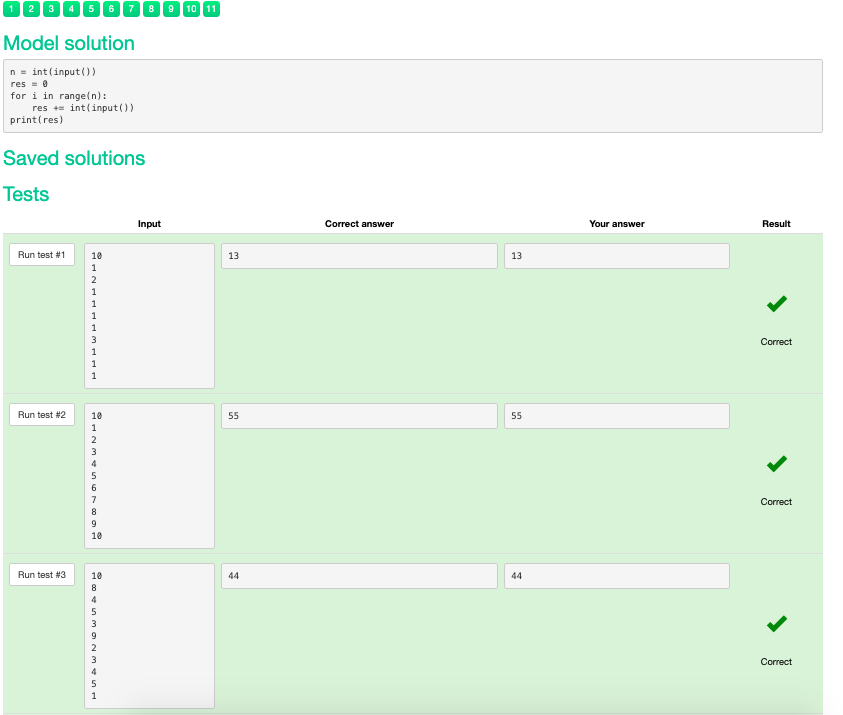

```.py
# Read an integer:
# a = int(input())
# Read a float:
# b = float(input())
# Print a value:
# print(a, b)
numzero = 0
for i in range(int(input())):
    if int(input()) == 0:
        numzero += 1
print(numzero)
```
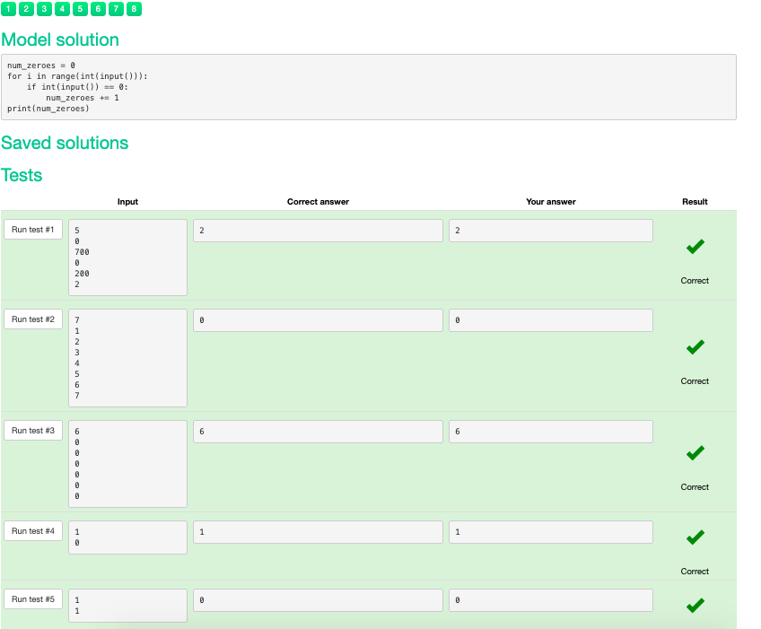

```.py
# Read an integer:
# a = int(input())
# Read a float:
# b = float(input())
# Print a value:
# print(a, b)
n = int(input())
sumcard = 0
for i in range(1, n + 1):
	sumcard += i
for i in range(n - 1):
	sumcard -= int(input())
print(sumcard)
```
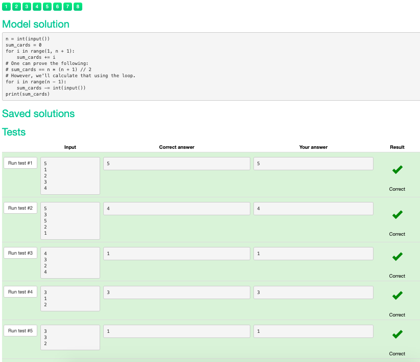

